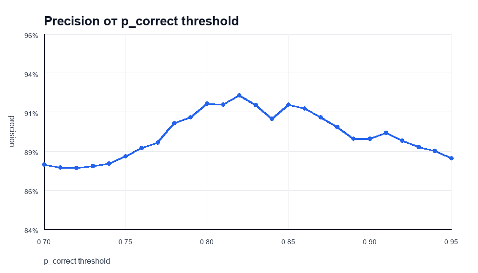
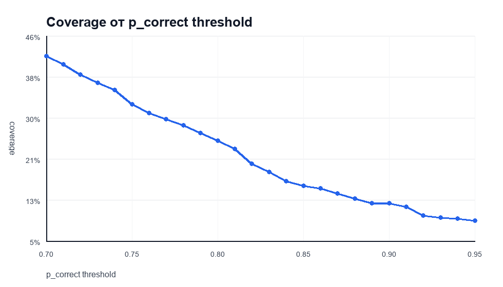
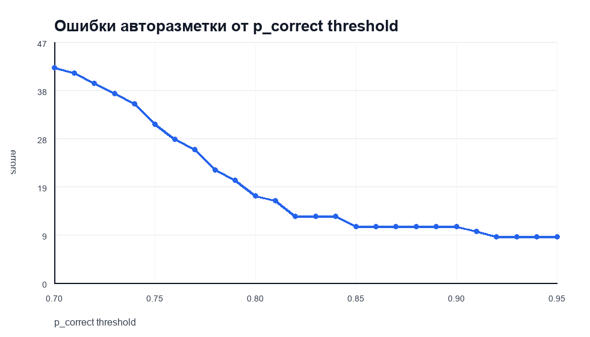
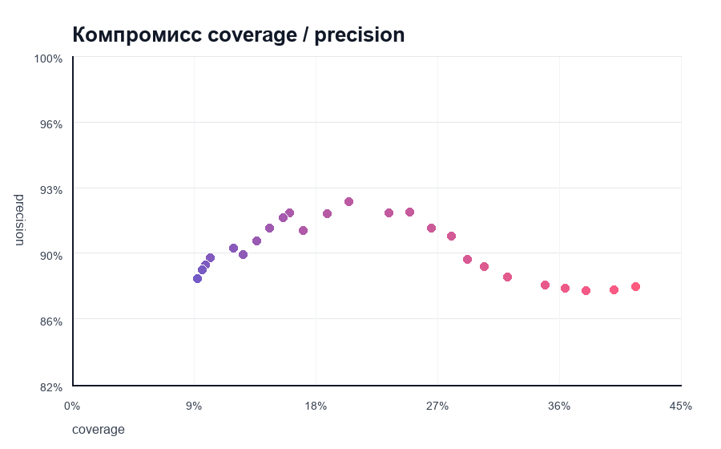
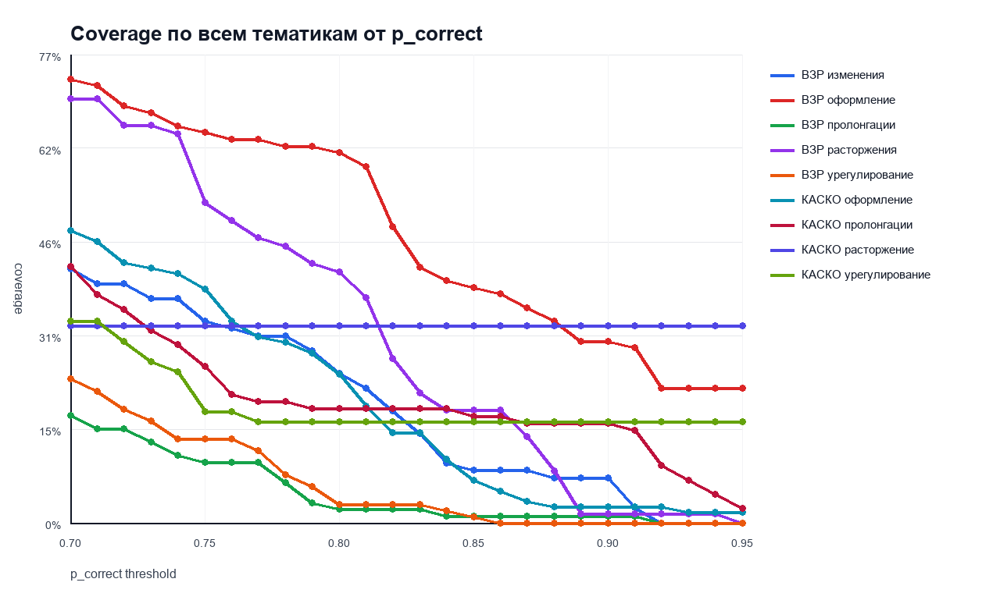
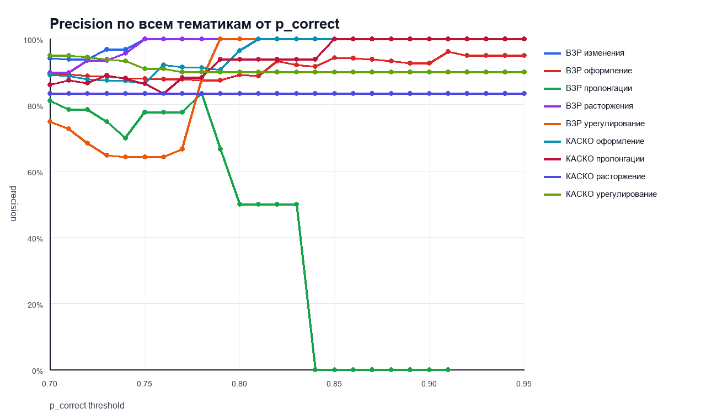
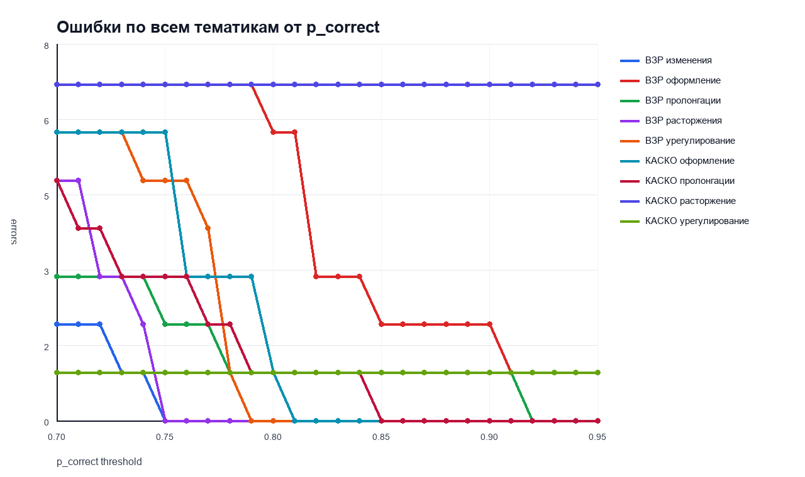
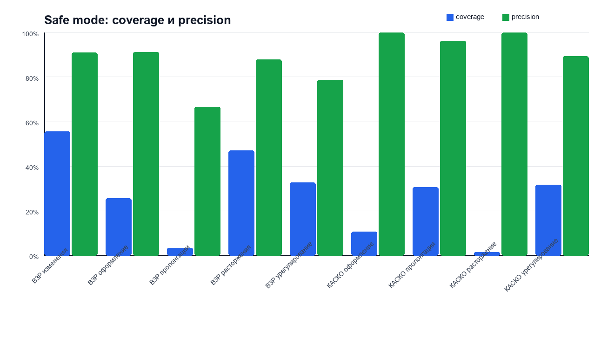
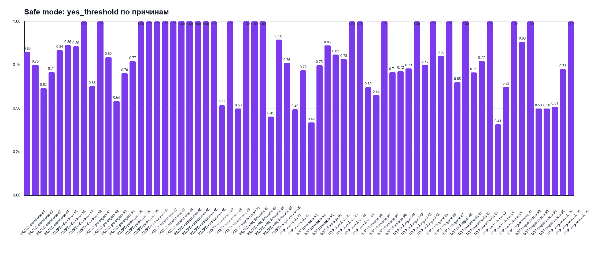

# AutoChecker

AutoChecker - это гибридный валидатор разметки классификатора для чатов поддержки.

## Проблема

Сейчас качество промптов и классификаторов часто проверяется вручную: классификатор подбирает чаты под конкретную причину обращения, а аналитик потом открывает каждый чат и ставит `да` или `нет` - подходит ли чат под эту причину.

На практике такая проверка занимает очень много времени. Одна разметка одной тематики, например `КАСКО - оформление`, может занимать почти полный рабочий день. Если тематик много и по каждой нужно несколько итераций промпта, команда тратит дни не на улучшение логики, а на однотипную ручную валидацию.

Главная боль процесса:

- долго проверять каждую новую итерацию промпта;
- сложно быстро понять, где классификатор стал лучше, а где хуже;
- ручная проверка плохо масштабируется на десятки тематик;
- много времени уходит на очевидные `да`, которые модель могла бы принимать сама;
- спорные кейсы все равно должны оставаться у аналитика, потому что цена ошибки в датасете высокая.

## Как решаем

AutoChecker не заменяет основной классификатор. Он работает как второй слой проверки:

```text
чат + причина от классификатора
        -> AutoChecker
        -> вероятность корректности p_correct
        -> auto_yes / auto_no / review
```

Идея простая: автоматически принимать только те строки, где валидатор уверен, что разметка классификатора корректна, а все спорное оставлять на ручную проверку.

В результате аналитик проверяет не весь массив, а только менее уверенную часть. Это не убирает человека из процесса полностью, но снимает часть самой монотонной работы и ускоряет итерации по промптам.

Важный эффект: модель становится полезнее с каждой новой итерацией. Все ручные проверки, которые аналитик все равно делает после `review`, можно добавлять обратно в обучающий датасет. Поэтому на сложных тематиках, где промпт приходится прогонять и исправлять несколько раз, AutoChecker должен работать все эффективнее: он постепенно накапливает примеры сложных `да`, типичных ошибок `нет` и пограничных кейсов именно этой тематики.

Главная цель первой версии: снять часть ручной проверки, но не пропускать много ошибочной разметки. Поэтому основной рабочий режим осторожный: автоматически принимать только те строки, где модель уверена, что причина выбрана правильно.

Подробное руководство по запуску и формату файлов вынесено отдельно:

[Руководство по пользованию](USER_GUIDE.md)

Для аналитика добавлен простой локальный интерфейс:

```bash
python -m auto_classifier.web_app
```

После запуска в браузере открывается `http://127.0.0.1:8787/`: туда можно
загрузить Excel с итерациями разметки и файл текстовок диалогов, а на выходе
получить размеченную последнюю итерацию. Внутри используется лучший текущий
гибридный режим: стабильные подпричины размечаются `да/нет`, рискованные
остаются в `review`.

## Задача

В текущем процессе классификатор размечает чаты по причинам обращения, например:

```text
чат клиента -> причина 5
```

После этого аналитик вручную проверяет выбор классификатора и ставит:

```text
да  - причина подходит
нет - причина не подходит
```

AutoChecker обучается на истории таких проверок и для новых строк оценивает:

- насколько выбранная причина похожа на прошлые правильные примеры;
- насколько она похожа на прошлые ошибки;
- есть ли нужные слова именно в сообщениях клиента;
- не сработала ли тема только из-за ответа оператора или бота;
- насколько уверены текстовая и embedding-модель.

Результат:

| Поле | Смысл |
|---|---|
| `p_correct` | вероятность, что причина классификатора корректна |
| `decision` | автоматическое решение: `auto_yes`, `auto_no` или `review` |
| `auto_answer` | итоговый ответ для ручной таблицы: `да`, `нет` или `review` |
| `nearest_positive_score` | похожесть на ближайший правильный пример |
| `nearest_negative_score` | похожесть на ближайшую прошлую ошибку |
| `rule_flags` | признаки по правилам и ролям |

## Как работает технически

### 1. Подготовка данных

На вход подаются две сущности:

- таблица с ручной проверкой: `chat_id`, `reason_id`, `да/нет`, комментарий;
- таблица с текстовками диалогов.

Команда `prepare` объединяет их по ID диалога и собирает обучающую таблицу:

```text
chat_id | chat_text | reason_id | human_label | comment
```

Значения ручной проверки нормализуются так:

| В таблице | В модели |
|---|---:|
| `да`, `да?`, `1` | `1` |
| `нет`, `нет?`, `0` | `0` |
| пусто | игнорируется |

Если классификатор вернул несколько причин, строка раскладывается на отдельные проверки по каждой причине.

### 2. Разбор ролей

Если в диалоге есть роли `client`, `manager`, `bot`, текст разделяется на части:

```text
client_text
operator_text
bot_text
full_text
```

Модель в первую очередь обучается на `client_text`, потому что причина обращения должна подтверждаться сообщениями клиента, а не только ответом оператора.

### 3. Модель на каждую причину

Для каждой причины обучается отдельный бинарный валидатор:

```text
reason_id = 5
задача: правильно ли классификатор поставил эту причину этому чату?
```

То есть модель не решает “какая причина у чата”. Она решает более узкую задачу:

```text
подходит ли уже выбранная причина?
```

Это важное отличие от обычного классификатора.

### 4. TF-IDF + LSA + Logistic Regression

Базовый смысловой сигнал строится так:

```text
текст клиента
  -> TF-IDF по словам и биграммам
  -> TruncatedSVD / LSA
  -> LogisticRegression(class_weight="balanced")
  -> p_lsa
```

Зачем это нужно:

- TF-IDF хорошо ловит устойчивые формулировки;
- LSA сжимает текстовое пространство и помогает находить близкие темы;
- Logistic Regression дает прозрачный и быстрый baseline.

Если данных мало, LSA может не включаться, и модель работает напрямую на TF-IDF.

### 5. Sentence embeddings

Если установлен `sentence-transformers`, используется embedding-модель:

```text
sentence-transformers/paraphrase-multilingual-MiniLM-L12-v2
```

Пайплайн:

```text
текст клиента
  -> sentence embedding
  -> LogisticRegression(class_weight="balanced")
  -> p_embedding
```

Embeddings нужны, чтобы ловить смысловые совпадения, когда клиент пишет разными словами:

```text
"полис продлится сам?"
"ожидаю автоматическое продление"
"раньше страховка сама обновлялась"
```

Если embeddings недоступны, программа работает в fallback-режиме без них.

### 6. Retrieval-сигналы

Для нового чата считается похожесть на исторические примеры этой же причины:

```text
sim_pos - похожесть на ближайшие правильные примеры
sim_neg - похожесть на ближайшие ошибки
sim_margin = sim_pos - sim_neg
```

Логика простая:

- если чат похож на прошлые `да`, это плюс;
- если похож на прошлые `нет`, это риск;
- если похожесть к ошибкам выше, строку лучше отправить в `review`.

### 7. Rule features

Дополнительно считаются легкие признаки из YAML-правил:

```text
client_keyword_hits
full_keyword_hits
operator_keyword_hits
bot_keyword_hits
client_required_hits
operator_only_hits
client_text_share
```

Они нужны для кейсов, где классификатор ошибается из-за оператора или бота. Например, тема сработала только потому, что оператор сам написал нужное слово, а клиент эту проблему не заявлял.

### 8. Финальный слой

Все сигналы объединяются в финальную модель:

```text
p_lsa
p_embedding
sim_pos
sim_neg
sim_margin
rule features
        -> LogisticRegression(class_weight="balanced")
        -> CalibratedClassifierCV, если достаточно данных
        -> p_correct
```

Если данных по причине мало, модель не падает, но помечает причину как low-data и не принимает ее автоматически широким порогом.

### 9. Подбор порогов

Для `auto_yes` подбирается отдельный порог:

```text
выбрать максимальный coverage при precision >= target_precision
```

По умолчанию цель:

```text
target_precision = 0.95
```

Если нужную точность достичь нельзя, причина уходит в `review`.

Для `auto_no` есть отдельный более строгий режим:

```text
target_no_precision = 0.97
```

По умолчанию `auto_no` выключен, потому что на текущих данных автоматическое `нет` оказалось менее стабильным, чем автоматическое `да`.

## Режимы принятия решений

### Global threshold

Экспериментальный режим для исследования:

```text
auto_yes, если p_correct >= общий порог
```

Например:

```text
p_correct >= 0.78
```

Плюс: легко сравнивать разные пороги.

Минус: один общий порог плохо подходит всем тематикам сразу.

### Safe mode

Практический режим:

```text
для каждой причины reason_id есть свой yes_threshold
если p_correct >= yes_threshold этой причины -> auto_yes
иначе -> review
```

Это лучше отражает реальную работу валидатора, потому что причины сильно отличаются по качеству, объему данных и уровню шума.

## Эксперименты

Эксперименты проводились на нескольких наборах ВЗР и КАСКО. Сырые чаты, Excel-файлы и подготовленные датасеты не входят в репозиторий и игнорируются через `.gitignore`.

В README включены только агрегированные графики без текстов диалогов.

Важная оговорка по качеству экспериментов: в наборах `КАСКО - расторжения` и `ВЗР - пролонгации` исходные таблицы отличаются от нормального шаблона и частично “криво” ложатся в общий формат подготовки данных. Поэтому результаты по этим двум тестам нельзя считать показательными для качества модели: они занижают общий итог и требуют отдельной нормализации входных файлов.

### Global threshold: общая динамика

<table>
<tr>
<td width="50%" valign="top">

<br><b>Вывод:</b> общий precision не растет монотонно при повышении порога. Это значит, что единая шкала `p_correct` пока плохо калибрована для всех тематик сразу.
</td>
<td width="50%" valign="top">

<br><b>Вывод:</b> чем ниже порог, тем больше авторазметки. Основной прирост покрытия находится в зоне `0.70-0.80`.
</td>
</tr>
<tr>
<td width="50%" valign="top">

<br><b>Вывод:</b> снижение порога увеличивает абсолютное число ошибок. Поэтому выбирать порог нужно не только по coverage, но и по допустимому числу ошибок.
</td>
<td width="50%" valign="top">

<br><b>Вывод:</b> компромиссная глобальная точка сейчас около `0.78`: coverage выше, чем на `0.80`, а precision еще держится около `90%`.
</td>
</tr>
</table>

### Все тематики на одном графике

<table>
<tr>
<td width="50%" valign="top">

<br><b>Вывод:</b> coverage по тематикам ведет себя очень по-разному. Общий порог будет слишком жестким для одних тематик и слишком мягким для других.
</td>
<td width="50%" valign="top">

<br><b>Вывод:</b> часть тематик держит высокий precision даже на низких порогах, а часть остается нестабильной. Поэтому лучше подбирать пороги отдельно.
</td>
</tr>
<tr>
<td width="50%" valign="top">

<br><b>Вывод:</b> ошибки концентрируются неравномерно. Сначала нужно ограничивать авторазметку для проблемных тематик и причин.
</td>
<td width="50%" valign="top">
<br><b>Общий вывод:</b> единый порог полезен для первичного исследования, но не выглядит лучшим вариантом для рабочего режима.
</td>
</tr>
</table>

### Safe mode

<table>
<tr>
<td width="50%" valign="top">

<br><b>Вывод:</b> safe-режим сильно отличается по тестам: часть тематик дает хорошее покрытие и точность, а слабые тесты сразу видны по низкому precision.
</td>
<td width="50%" valign="top">

<br><b>Вывод:</b> индивидуальные пороги причин сильно различаются. Низкий порог может давать больше авторазметки, но такие причины нужно отдельно проверять на ошибки.
</td>
</tr>
</table>

## Численные результаты

Global threshold по всем тестам:

| `p_correct` threshold | Авторазметка | Precision | Ошибки |
|---:|---:|---:|---:|
| `0.70` | `41.7%` | `87.7%` | `42` |
| `0.75` | `32.2%` | `88.3%` | `31` |
| `0.78` | `28.0%` | `90.4%` | `22` |
| `0.80` | `25.0%` | `91.7%` | `17` |
| `0.95` | `9.3%` | `88.2%` | `9` |

Если использовать **один общий `p_correct` для всех тематик**, лучший рабочий выбор сейчас:

```text
p_correct >= 0.78
```

Почему именно `0.78`: это первый порог в эксперименте, где общий precision поднялся выше `90%`, при этом coverage еще остается заметным - около `28%` авторазметки. Порог `0.80` можно брать как более осторожную версию: ошибок меньше (`17` вместо `22`), но и авторазметки меньше (`25%` вместо `28%`). Порог `0.70-0.75` дает больше покрытия, но precision опускается ниже `90%`, поэтому его лучше не использовать как общий рабочий порог без дополнительных ограничений по тематикам.

Safe mode по тестам:

| Тест | Labeled | Auto labeled | Coverage | Precision | Errors |
|---|---:|---:|---:|---:|---:|
| ВЗР изменения | 81 | 45 | 55.56% | 91.11% | 4 |
| ВЗР оформление | 90 | 23 | 25.56% | 91.30% | 2 |
| ВЗР пролонгации | 90 | 3 | 3.33% | 66.67% | 1 |
| ВЗР расторжения | 70 | 33 | 47.14% | 87.88% | 4 |
| ВЗР урегулирование | 101 | 33 | 32.67% | 78.79% | 7 |
| КАСКО оформление | 114 | 12 | 10.53% | 100.00% | 0 |
| КАСКО пролонгации | 85 | 26 | 30.59% | 96.15% | 1 |
| КАСКО расторжение | 129 | 2 | 1.55% | 100.00% | 0 |
| КАСКО урегулирование | 60 | 19 | 31.67% | 89.47% | 2 |

По всем тестам safe mode автоматически принял `196` из `820` размеченных строк:

```text
общая авторазметка = 23.9%
```

Если исключить два набора с проблемным форматом таблиц (`КАСКО - расторжения` и `ВЗР - пролонгации`), safe mode автоматически принимает `191` из `601` строк:

```text
авторазметка на корректно подготовленных таблицах = 31.8%
```

Это число ближе к реальному ожидаемому эффекту при нормальном формате входных данных.

## Главные выводы

1. AutoChecker уже может автоматически принимать часть `да`-разметки, но качество сильно зависит от тематики.
2. Единый глобальный порог `p_correct` удобен для анализа, но не подходит как финальный рабочий режим.
3. Если брать один общий порог для всех тематик, основной рекомендуемый вариант - `p_correct >= 0.78`: примерно `28%` авторазметки при precision около `90.4%`.
4. Более осторожный общий вариант - `p_correct >= 0.80`: примерно `25%` авторазметки при precision около `91.7%` и меньшем числе ошибок.
5. Общий precision `95%+` на глобальном пороге `0.70-0.95` сейчас не достигается.
6. Safe mode лучше отражает реальную механику валидатора, потому что использует отдельные пороги по причинам.
7. `auto_no` пока лучше держать выключенным или использовать очень строго: отрицательные решения сложнее, потому что “нет” бывает разных типов.
8. `КАСКО - расторжения` и `ВЗР - пролонгации` нужно отдельно привести к нормальному шаблону данных: текущие результаты по ним отражают не только качество модели, но и проблему формата таблиц.

## Оценка экономии времени

Если ручная проверка одной тематики занимает почти один рабочий день, то экономия времени примерно равна доле строк, которые AutoChecker принимает автоматически.

При текущем оптимальном общем пороге:

```text
p_correct >= 0.78
авторазметка ≈ 28%
экономия ≈ 0.28 рабочего дня на одну тематику
```

В safe mode на корректно подготовленных таблицах:

```text
авторазметка ≈ 31.8%
экономия ≈ 0.32 рабочего дня на одну тематику
```

Если команда проверяет `10` тематик в месяц, ориентировочная экономия:

| Режим | Авторазметка | Экономия на 10 тематик |
|---|---:|---:|
| Общий порог `p_correct >= 0.78` | 28.0% | около 2.8 рабочих дня в месяц |
| Safe mode без двух проблемных таблиц | 31.8% | около 3.2 рабочих дня в месяц |

Формула для другого объема:

```text
экономия в рабочих днях = количество тематик в месяц * процент авторазметки
```

Например, при `20` тематиках в месяц safe mode может сэкономить около `6.4` рабочих дня, если входные таблицы приведены к нормальному шаблону.

## Финальная рекомендация

Для текущей версии лучший практический путь:

```text
1. Использовать safe mode как основной режим.
2. Если нужен один общий p_correct, брать p_correct >= 0.78.
3. Для более осторожного общего режима брать p_correct >= 0.80.
4. Автоматически принимать только auto_yes.
5. Не включать широкий auto_no без отдельной доработки.
6. Для сильных тематик расширять авторазметку через reason-specific thresholds.
7. Для слабых тематик сначала анализировать accepted errors и доразмечать ошибки.
8. До следующего сравнения привести `КАСКО - расторжения` и `ВЗР - пролонгации` к общему шаблону, иначе они будут искажать общий результат.
```

Если цель - быстро снять часть ручной проверки, можно начать с safe mode и отдельно разрешить авторазметку только для причин, где на валидации precision стабильно выше `90-95%`.

Если цель - максимальная надежность, нужно идти к порогам по каждой причине и отключать авторазметку там, где недостаточно данных или много ошибок.

## Структура проекта

```text
auto_classifier/
  cli.py                 # train / verify / evaluate / prepare
  data.py                # чтение таблиц, алиасы колонок, да/нет
  prepare.py             # объединение разметки и текстовок
  text.py                # разбор ролей client / manager / bot
  features.py            # TF-IDF, LSA, embeddings, rule features, similarity
  model.py               # обучение per-reason валидаторов и подбор порогов
  reports.py             # отчеты
  configs/default_rules.yaml
  tests/test_core.py
USER_GUIDE.md            # подробное руководство по запуску
docs/
  experiments/
    p_correct_sweep/     # безопасные агрегированные графики экспериментов
```

## Быстрый запуск

Подробно команды описаны в [руководстве](USER_GUIDE.md). Короткая версия:

```bash
python3 -m venv auto_classifier/.venv
source auto_classifier/.venv/bin/activate
pip install -r auto_classifier/requirements-minimal.txt
```

Подготовка данных:

```bash
python3 -m auto_classifier.cli prepare \
  --labels "labels.xlsx" \
  --messages "messages.xlsx" \
  --output "prepared.csv"
```

Обучение:

```bash
python3 -m auto_classifier.cli train \
  --data "prepared.csv" \
  --out "auto_classifier/models/model_v1" \
  --target-precision 0.95 \
  --no-embeddings
```

Проверка новых результатов:

```bash
python3 -m auto_classifier.cli verify \
  --model "auto_classifier/models/model_v1" \
  --input "new_classifier_results.xlsx" \
  --output "checked_results.xlsx"
```

## Безопасность данных

Репозиторий настроен так, чтобы не отправлять в GitHub сырые данные:

- Excel-файлы;
- CSV с разметкой;
- текстовки чатов;
- подготовленные датасеты;
- модели;
- локальные отчеты с предсказаниями.

В Git можно добавлять код, документацию и агрегированные графики без текстов диалогов.

## Рабочие методы авторазметки

Сейчас есть два разных рабочих сценария. Они решают похожую задачу, но оптимизируют разные метрики.

### 1. Гибридный метод

Гибридный метод нужен, когда важно автоматически разметить часть строк и при этом сохранить высокую точность именно по строкам, которые AutoChecker принял.

Логика:

```text
чат -> p_correct
подпричина стабильная -> full yes/no
подпричина рискованная -> safe mode: только уверенные "да", остальное review
```

Технически роутер смотрит на подпричину и решает, можно ли ей доверять:

- достаточно ли исторических строк по этой подпричине;
- насколько сильно прыгала ручная точность между итерациями;
- насколько средний `p_correct` согласуется с историей;
- не слишком ли низкая ожидаемая точность подпричины: `max(средний p_correct, последняя история)`;
- достаточно ли высокий текущий средний `p_correct`, чтобы история не переоптимистично тянула слабую новую пачку в full-разметку;
- насколько хорошо персональный `p_correct`-порог этой подпричины раньше воспроизводил ручные `да/нет`;
- замаплена ли подпричина на стабильный `subreason_key`.

Если подпричина стабильная, она идет в `full yes/no`: строковое решение `да/нет` ставится через персональный `p_correct`-порог, обученный для этой подпричины на прошлых ручных разметках. Старое forced top-N правило из рабочего режима убрано, потому что оно искусственно фиксировало долю `да`.

Если подпричина рискованная, она идет в `safe mode`: AutoChecker ставит только уверенные `да`, а все спорное отправляет в `review`.

Результат текущего backtest на твоих данных:

| Режим | Строк | Автострок | Review | Coverage | Precision | Ошибки | Auto yes | Auto no |
|---|---:|---:|---:|---:|---:|---:|---:|---:|
| Safe-only `target_precision=0.80` | 820 | 306 | 514 | 37.32% | 89.54% | 32 | 306 | 0 |
| Гибридный роутер без top-N | 820 | 356 | 464 | 43.41% | 90.73% | 33 | 355 | 1 |

То есть гибридная версия автоматически размечает больше чатов: `356` строк вместо `306`, coverage растет с `37.32%` до `43.41%`, а precision поднимается до `90.73%`. Это рабочий режим без forced top-N: количество `да` не фиксируется заранее, строки проходят через персональный threshold и риск-роутер.

Дополнительное сравнение вариантов показало:

| Вариант | Coverage | Precision | Ошибки | Автострок |
|---|---:|---:|---:|---:|
| `hybrid_current` | 43.41% | 90.73% | 33 | 356 |
| `hybrid_selective_p85` | 33.66% | 92.39% | 21 | 276 |
| `hybrid_selective_p90` | 26.10% | 93.46% | 14 | 214 |
| Safe-only `target_precision=0.80` | 37.32% | 89.54% | 32 | 306 |
| Legacy top-N, только для сравнения | 48.41% | 90.18% | 39 | 397 |
| `hybrid_more_coverage` | 43.90% | 88.33% | 42 | 360 |

Вывод: основной рабочий вариант сейчас - `hybrid_current`. Он совмещает safe-only и полную threshold-разметку, использует `max(p_correct, последняя история)` как оценку стабильности подпричины, но не дает истории насильно протащить слабую новую пачку в full. Старый top-N оставлен только как legacy-эксперимент, потому что он искусственно фиксирует долю `да`.

Команда для запуска гибридного метода:

```bash
python -m auto_classifier.cli evaluate-hybrid-router \
  --train "auto_classifier/local_data/prepared/kasko_oformlenie_auto_train.csv" \
  --data "auto_classifier/local_data/prepared/kasko_oformlenie_auto_val.csv" \
  --output "auto_classifier/local_data/reports/hybrid_router_backtest/kasko_oformlenie.xlsx" \
  --subreason-map "auto_classifier/configs/subreason_versions.yaml" \
  --group-by-subreason-key \
  --no-embeddings
```

Файлы реализации:

- `quota_yesno.py` - логика гибридного роутера;
- `cli.py` - команда `evaluate-hybrid-router`;
- `scripts/run_hybrid_router_backtest.py` - общий backtest по всем текущим тестам.

### 2. Полный метод `max(p_correct, последняя история)`

Полный метод нужен для другого сценария: когда хочется получить оценку точности новой итерации почти по всем строкам без `review`.

Это не такой же режим, как гибридный. Гибридный метод оптимизирует **precision среди автоматически принятых строк**. Полный метод оптимизирует **похожесть итоговой точности подпричины на ручную точность**.

Логика:

```text
чат -> p_correct
подпричина -> средний p_correct по новой итерации
подпричина -> последняя ручная точность этой же подпричины
оценка точности = max(средний p_correct, последняя история)
```

Почему берется `max`: на твоих тестах модель часто занижала точность новой итерации, особенно когда промпт реально стал лучше после правок. Последняя история работает как нижняя опора: если подпричина уже была хорошей, не стоит автоматически опускать оценку слишком низко только из-за осторожного `p_correct`.

Важно: этот режим лучше использовать именно для оценки точности промпта по подпричинам, а не как строковый forced `да/нет`. Он не должен сам превращаться в top-N-разметку. Если нужно физически поставить `да/нет` каждой строке, это должен делать отдельный строковый классификатор или персональный threshold по подпричине.

Результат исследования на твоих данных:

| Метод | Оценено строк | Ручная точность | Автооценка | Gap | Абс. ошибка |
|---|---:|---:|---:|---:|---:|
| `max(p_correct, последняя история)` | 810 | 82.84% | 76.00% | -6.84 п.п. | 11.84 п.п. |
| `guarded_bayes_k40` | 810 | 82.84% | 73.50% | -9.34 п.п. | 12.51 п.п. |
| `hard_history_all` | 587 | 82.96% | 80.41% | -2.56 п.п. | 17.89 п.п. |
| `mean_p_correct` | 820 | 82.93% | 64.07% | -18.86 п.п. | 21.32 п.п. |

По причинам лучший честный full-estimate вариант `max(p_correct, последняя история)` выглядел так:

| Причина | Абс. ошибка |
|---|---:|
| ВЗР Изменения | 4.11 п.п. |
| ВЗР Оформление | 4.92 п.п. |
| КАСКО Пролонгации | 6.71 п.п. |
| КАСКО Оформление | 8.06 п.п. |
| КАСКО Урегулирование | 9.66 п.п. |
| ВЗР Расторжения | 9.70 п.п. |
| ВЗР Пролонгации | 12.52 п.п. |
| ВЗР Урегулирование | 19.48 п.п. |
| КАСКО Расторжение | 24.51 п.п. |

Главное отличие от гибрида:

| Вопрос | Гибридный метод | `max(p_correct, последняя история)` |
|---|---|---|
| Что оптимизируем | Точность авторазмеченных строк | Близость к ручной точности подпричины |
| Есть `review` | Да | Нет или почти нет |
| Главная метрика | Coverage и precision | Абсолютная ошибка оценки точности |
| Лучший текущий результат | 43.41% coverage при 90.73% precision без top-N | 11.84 п.п. средней абсолютной ошибки |
| Когда использовать | Чтобы снять часть ручной проверки | Чтобы быстро оценить точность новой итерации промпта |

Файлы исследования:

- `scripts/research_full_yesno_error_reduction.py` - сравнение full-estimate методов;
- `local_data/reports/full_yesno_error_reduction/estimator_summary_overall.csv` - общие результаты;
- `local_data/reports/full_yesno_error_reduction/estimator_summary_by_topic.csv` - разрез по причинам;
- `local_data/reports/full_yesno_error_reduction/README.md` - подробные выводы.

## Идеи и предложения

Если есть идеи, предложения по доработке или кейсы, на которых AutoChecker работает нестабильно, пишите `d.sadakov`.
